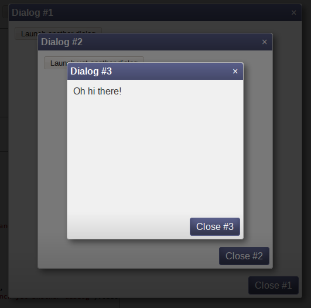

# jQuery Dialog!
What could possibly go wrong with another one of these?



## DEMO
[YES THIS IS DEMO.](http://tmont.github.io/jquery-dialog/)

## Installation
Reference `jquery.dialog.js` somewhere. You'll also need to add the
`dialog.css` stylesheet as well, unless you want them to look bad.

If you're feeling frisky, you can also rock the `dialog.less` file
and configure Less compilation.

## Browser Support
* Firefox
* Chrome
* Safari
* IE9+
* Maybe IE8 if you change rgba() values to use opacity

## Usage
Default options:

```javascript
$.dialog({
	// body of the dialog, either a string, a jQuery instance, or
	// a function that returns the body in a callback
	body: '',

	// title text
	title: '',

	//HTML or jQuery/DOM for footer
	footer: '',

	// position the dialog at a specific place, e.g. { top: 40, left: 100 }
	position: null,

	// dynamically keep the dialog in the center of the screen
	dynamic: true,

	// use an overlay to prevent interaction with the background
    modal: false,

    // dimensions of the dialog
    width: null,
    height: null,

    // with "modal: true", specifies whether clicking on the background
    // will close the dialog
    closeOnMaskClick: true,

    // close the dialog when the user presses ESC
    closeOnEscape: true,

    // show the li'l "X" in the top right corner
    closeX: true,

    // with "modal: true", allow scrolling of the background
    allowScrolling: false,

    // top and left gutter for long/wide dialogs
    gutter: 20,

    // event callbacks (always remember to invoke the callback argument!)
    onHiding: function(catalyst, callback) { callback(); },
    onShowing: function(callback) { callback(); },

    // enable CSS transitions for the modal mask
    transitionMask: true,

    // show some buttons (see examples below)
    buttons: {}
});
```

Here's how you might actually use it:

```javascript
$('button').click(function() {
	var dialog = $.dialog({
		body: 'If I said you had a nice body would you hold it against me?',
		title: 'Corny pickup lines',
		buttons: { close: 'Close' }
	});

	dialog.show(); //you can also pass { show: true } to the options

	window.setTimeout(function() {
		dialog.hide();
	}, 1000);

	// you can also get a hold of ALL dialogs:
	$('.dialog-container').dialog('hide');
});
```

### Events
The dialog emits two events: `hide` and `show`. They are emitted when the dialog
has been hidden, and when the dialog has been shown. I'll let you figure out
which event does which.


## Development
```bash
git clone git@github.com:tmont/jquery-dialog.git
cd jquery-dialog
npm install
npm start
```